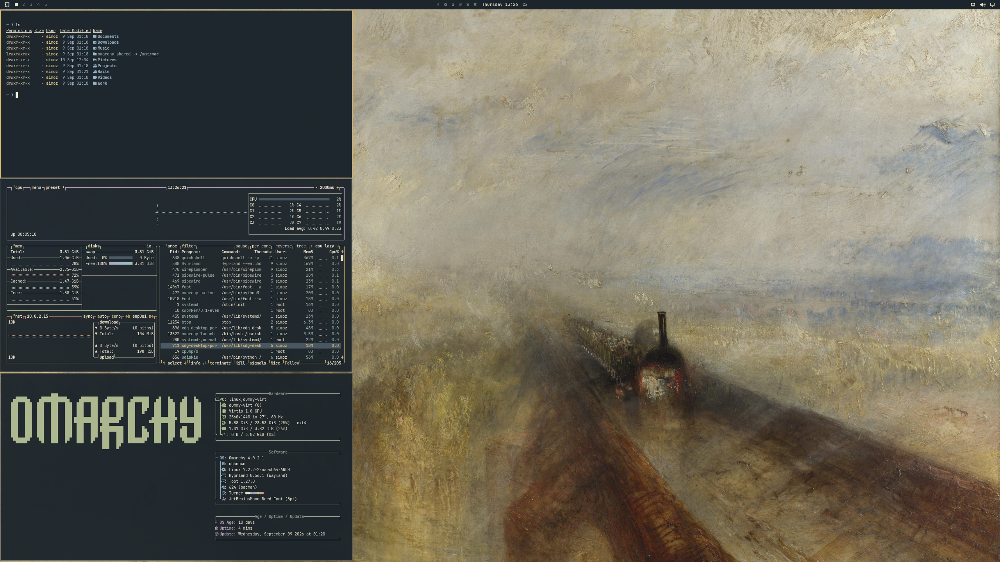

# Turner · Omarchy 4

A dark theme inspired by J. M. W. Turner: smoky blue, golden light, ivory, and the colors of water and mist, accompanied by nine high-resolution paintings. The palette is an interpretation for the interface, not an automatic extraction from the paintings.



[Browse all nine wallpapers, with resolutions and sources](docs/BACKGROUNDS.md). Wallpapers range from 4096 to 5120 pixels wide, with original proportions and no upscaling; approximately 30.3 MiB in total. The gallery uses lightweight previews. Full-resolution originals remain available through the source links.

## Inspiration

Joseph Mallord William Turner (1775–1851) explored light, color, and atmosphere. From Rain, Steam and Speed to Snow Storm, this collection moves between calm and turbulence, inspiring a desktop palette of smoky blues, warm gold, and soft ivory.

## Installation

Run this command on your Omarchy machine to install and apply the theme:

```sh
omarchy theme install https://github.com/simoz/omarchy-turner-theme
```

To switch back, select your previous theme from Omarchy's theme menu.

## Backgrounds

Click a preview to open the wallpaper.

| | | |
| --- | --- | --- |
| [](backgrounds/01-rain-steam-and-speed.jpg) | [](backgrounds/02-snow-storm.jpg) | [](backgrounds/03-inverary-pier.jpg) |
| [](backgrounds/04-staffa-fingals-cave.jpg) | [](backgrounds/05-dogana-santa-maria-della-salute.jpg) | [](backgrounds/06-keelmen-by-moonlight.jpg) |
| [](backgrounds/07-dort-or-dordrecht.jpg) | [](backgrounds/08-wreckers-northumberland.jpg) | [](backgrounds/09-the-fighting-temeraire.jpg) |

## Palette

| Role | Color |
| --- | --- |
| Smoky blue background | `#1c252b` |
| Surfaces | `#303b42` |
| Ivory text | `#eee4cd` |
| Gold accent | `#d8b56d` |
| Selection | `#465663` |
| Secondary text | `#a6a69a` |
| Terracotta | `#d58e79` |
| Pale blue | `#99b4c9` |

`colors.toml` contains the full palette, including bright terminal variants. `icons.theme` selects `Yaru-wartybrown`.

The palette stays fixed when the wallpaper changes. Blue-gray shadows echo the seascapes, gold and terracotta recall sunlight and reflections, and ivory and pale blue connect the luminous skies to the UI. Green and mauve remain distinct to keep code and terminal messages readable.

Contrast ratios calculated for opaque colors: primary text 12.32:1 against the background; selected text 6.94:1; secondary text 4.67:1 on lighter surfaces. Normal terminal colors, excluding black used as a background, exceed 4.5:1 against the main background. Transparency and application customizations may change these results.

## Compatibility

The theme uses the Omarchy 4 format. Omarchy generates application configurations from its [official templates](https://github.com/omacom/omarchy/tree/quattro/default/themed), so separate configuration copies for each application are unnecessary.

## Paintings and credits

**Cover: J. M. W. Turner, Rain, Steam and Speed – The Great Western Railway, 1844.** National Gallery, London.

- [Cover artwork source and original download](https://commons.wikimedia.org/wiki/File:Turner_-_Rain,_Steam_and_Speed_-_National_Gallery_file.jpg)
- [National Gallery of Art Open Access policy](https://www.nga.gov/terms-and-notices)

The two National Gallery of Art JPEGs are available under CC0. The other seven reproductions come from Wikimedia Commons, where they are marked as public domain. The distributed wallpapers are resized and JPEG-compressed where useful, without artistic color adjustments; Snow Storm has a slight border trim. [The gallery](docs/BACKGROUNDS.md) lists the artist, collection, and source for each painting; [the JSON catalog](docs/backgrounds.json) records original download URLs, original and distributed dimensions and SHA-256 checksums, and processing details. Painting credits are separate from the theme's original palette.

## License

The theme's original configuration, scripts, and documentation are licensed under the [MIT License](LICENSE).

Painting reproductions in `backgrounds/` and `docs/previews/` retain their public-domain or CC0 status and are not covered by this MIT license. See [painting credits and sources](docs/BACKGROUNDS.md) for details.
