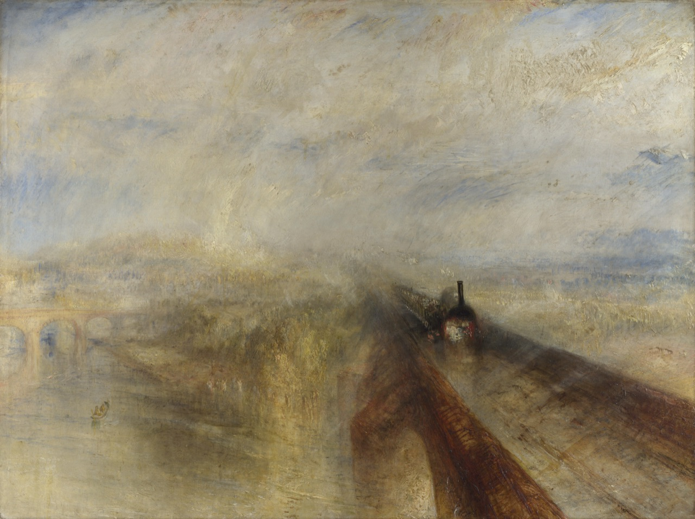
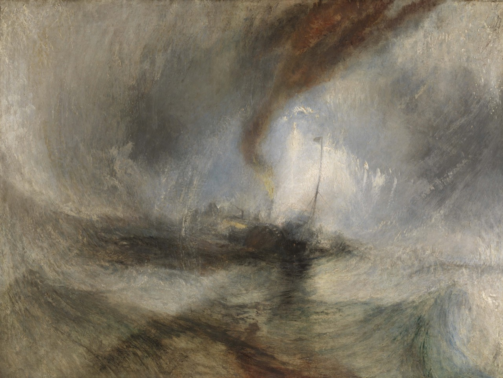
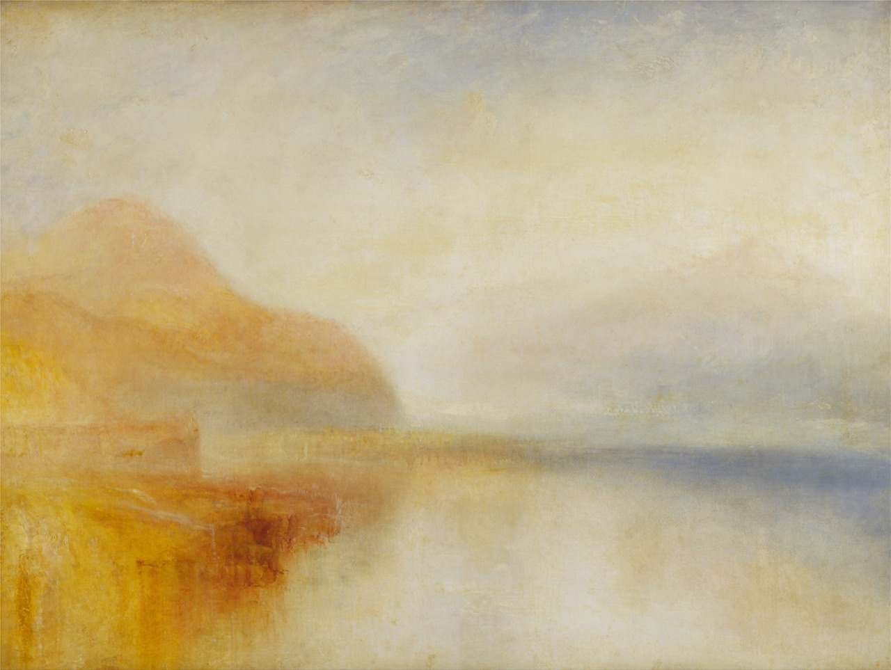
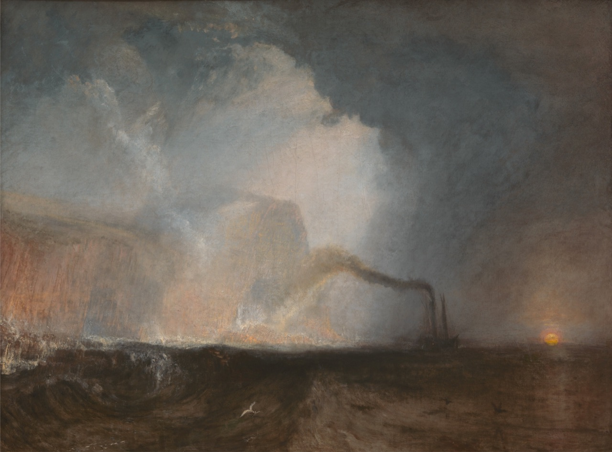
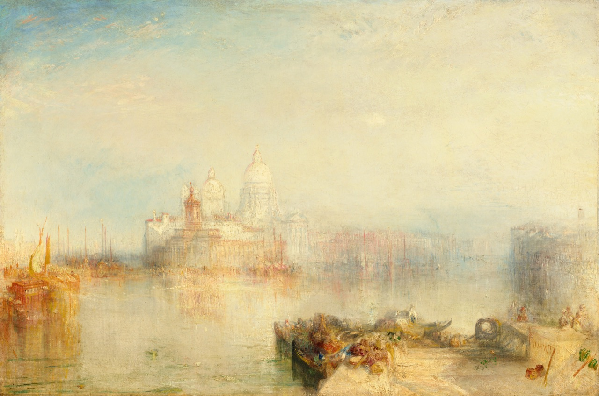
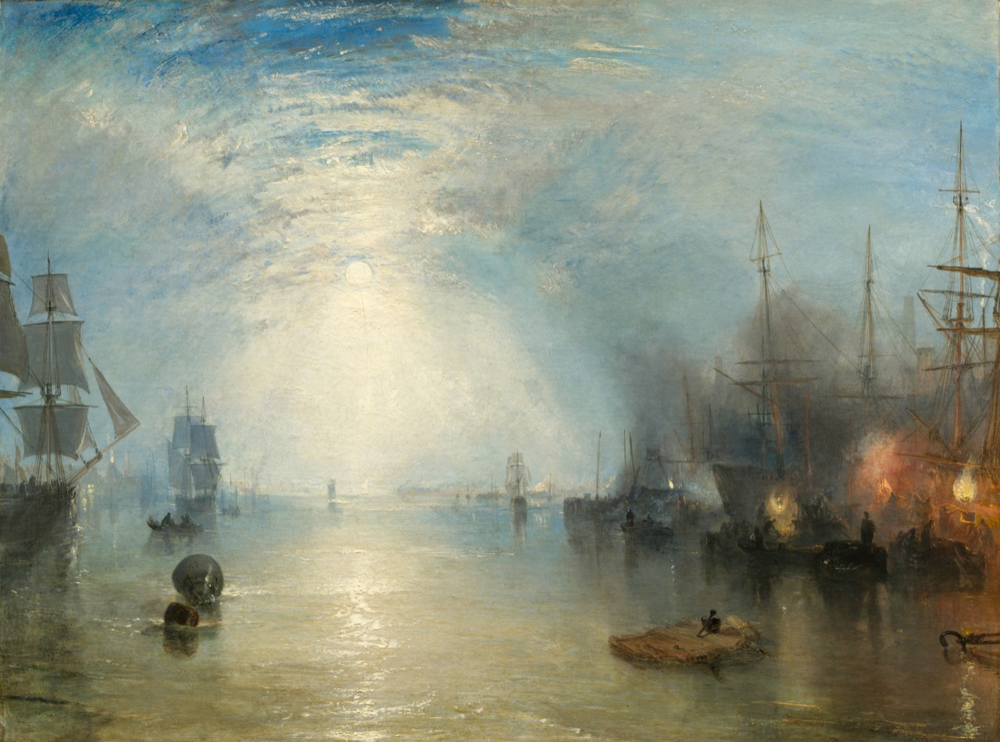
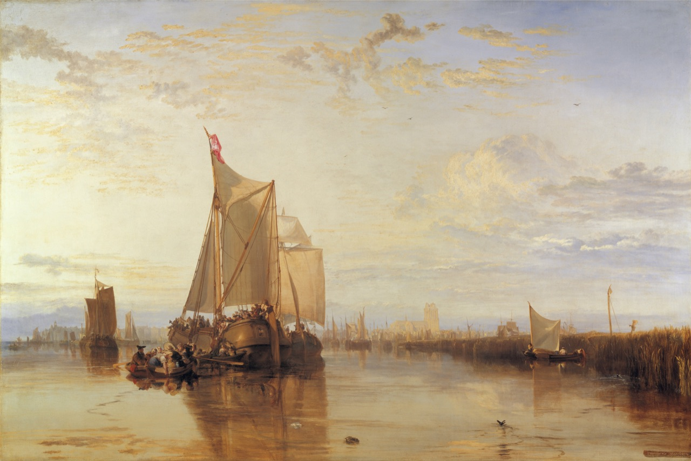
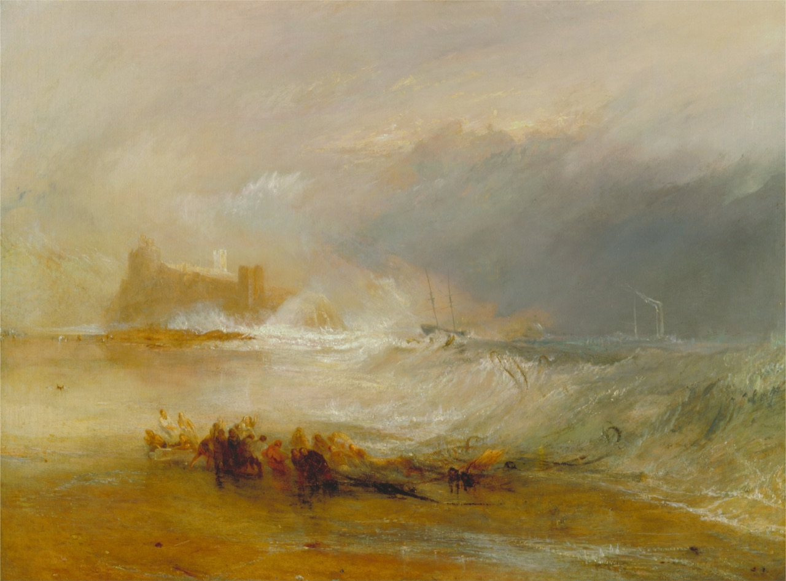
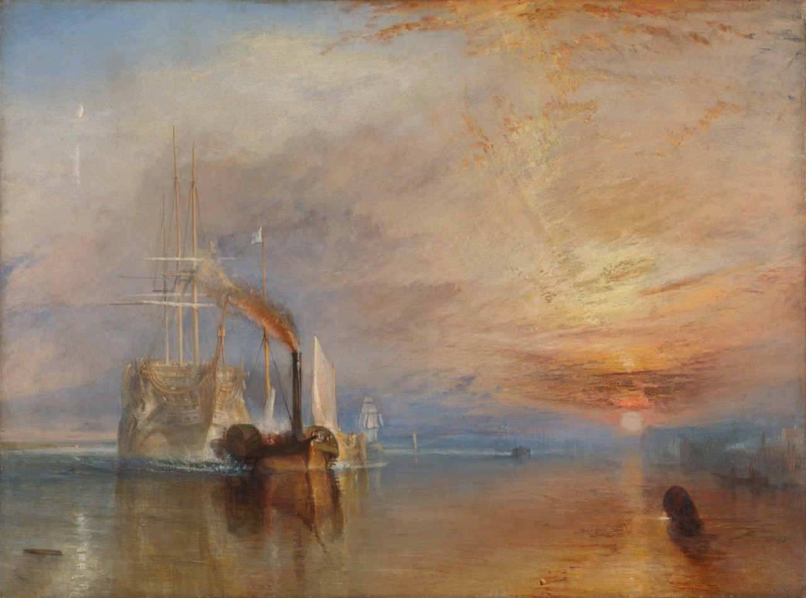

# Nine Turner wallpapers

The distributed JPEG wallpapers have a maximum long edge of 5120 pixels, with no upscaling or artistic color adjustments. Original aspect ratios are preserved to pixel rounding. Snow Storm has a centered trim of approximately 1% per edge to remove the dark outer border. Images already below the size limit are kept unchanged when recompression would increase their file size. The wallpapers total approximately 30.3 MiB; the 1280-pixel previews total approximately 2.2 MiB.

**Rain, Steam and Speed** is first in the filename sequence and is the README cover. **Snow Storm** follows second, pairing rain and steam with a sea swept by snow. The collection alternates between turbulence and stillness: the Venetian view and **Dort** offer quiet harbors, while the storms dissolve ships and horizons into light and vapor. After the opening pair, luminous harbors alternate with darker seas and moonlight, ending with **The Fighting Temeraire** at sunset. The theme palette stays fixed when switching paintings. **Staffa**, **Keelmen**, and **The Fighting Temeraire** closely match its smoky blue shadows and gold accents. **Inverary Pier** is the airiest and most luminous alternative.

All nine images support a 3840 × 2160 crop without upscaling. A centered 16:9 crop was visually reviewed: the main subjects remain visible, but approximately 15–25% of the painting's height is lost, including details near the edges. The distributed files retain the full composition apart from the slight border trim on Snow Storm. Actual display and cropping depend on your wallpaper settings; ultrawide screens crop more. Appearance in a live Omarchy session has not been verified.

The NGA source images are distributed under [Open Access CC0](https://www.nga.gov/terms-and-notices). The other source reproductions are marked as public domain on their respective Commons pages, with sources from the National Gallery, Tate Britain, or Yale / Google Art Project. This project is not affiliated with the museums. Original downloads are linked below; the JSON catalog records their dimensions and checksums separately from the optimized files.

## 01 · Rain, Steam and Speed – The Great Western Railway

1844 · **Wallpaper: 5120 × 3822 px** · Original: 5661 × 4226 px.

National Gallery, London.

[Source and rights](https://commons.wikimedia.org/wiki/File:Turner_-_Rain,_Steam_and_Speed_-_National_Gallery_file.jpg) · [Wallpaper JPEG](../backgrounds/01-rain-steam-and-speed.jpg) · [Full-resolution original](https://upload.wikimedia.org/wikipedia/commons/9/96/Turner_-_Rain%2C_Steam_and_Speed_-_National_Gallery_file.jpg?utm_source=commons.wikimedia.org&utm_campaign=imageinfo&utm_content=original)

## 02 · Snow Storm – Steam-Boat off a Harbour’s Mouth

1842 · **Wallpaper: 5018 × 3772 px** · Original: 7247 × 5448 px.

Tate Britain, London; Turner Bequest, 1856.

[Source and rights](https://commons.wikimedia.org/wiki/File:J.M.W._Turner_%E2%80%93_Snow_Storm_-_Steam-Boat_off_a_Harbour%27s_Mouth.jpg) · [Wallpaper JPEG](../backgrounds/02-snow-storm.jpg) · [Full-resolution original](https://upload.wikimedia.org/wikipedia/commons/e/e4/J.M.W._Turner_%E2%80%93_Snow_Storm_-_Steam-Boat_off_a_Harbour%27s_Mouth.jpg)

## 03 · Inverary Pier, Loch Fyne: Morning

c. 1845 · **Wallpaper: 5120 × 3853 px** · Original: 5630 × 4237 px.

Yale Center for British Art, Paul Mellon Collection.

[Source and rights](https://commons.wikimedia.org/wiki/File:Joseph_Mallord_William_Turner_-_Inverary_Pier,_Loch_Fyne-_Morning_-_Google_Art_Project.jpg) · [Wallpaper JPEG](../backgrounds/03-inverary-pier.jpg) · [Full-resolution original](https://upload.wikimedia.org/wikipedia/commons/f/fd/Joseph_Mallord_William_Turner_-_Inverary_Pier%2C_Loch_Fyne-_Morning_-_Google_Art_Project.jpg?utm_source=commons.wikimedia.org&utm_campaign=imageinfo&utm_content=original)

## 04 · Staffa, Fingal’s Cave

1831–1832 · **Wallpaper: 5120 × 3786 px** · Original: 5259 × 3889 px.

Yale Center for British Art, Paul Mellon Collection.

[Source and rights](https://commons.wikimedia.org/wiki/File:Joseph_Mallord_William_Turner_-_Staffa,_Fingal%27s_Cave_-_Google_Art_Project.jpg) · [Wallpaper JPEG](../backgrounds/04-staffa-fingals-cave.jpg) · [Full-resolution original](https://upload.wikimedia.org/wikipedia/commons/e/e5/Joseph_Mallord_William_Turner_-_Staffa%2C_Fingal%27s_Cave_-_Google_Art_Project.jpg?utm_source=commons.wikimedia.org&utm_campaign=imageinfo&utm_content=original)

## 05 · The Dogana and Santa Maria della Salute, Venice

1843 · **Wallpaper: 4096 × 2714 px** · Original: 4096 × 2714 px.

Courtesy National Gallery of Art, Washington; Samuel H. Kress Collection, 1961.2.3.

[Source and rights](https://www.nga.gov/artworks/46089-dogana-and-santa-maria-della-salute-venice) · [Wallpaper JPEG](../backgrounds/05-dogana-santa-maria-della-salute.jpg) · [Full-resolution original](https://api.nga.gov/iiif/132e789c-27da-4f54-a68d-3e2b691a9448/full/full/0/default.jpg)

## 06 · Keelmen Heaving in Coals by Moonlight

1835 · **Wallpaper: 4096 × 3042 px** · Original: 4096 × 3042 px.

Courtesy National Gallery of Art, Washington; Widener Collection, 1942.9.86.

[Source and rights](https://www.nga.gov/artworks/1225-keelmen-heaving-coals-moonlight) · [Wallpaper JPEG](../backgrounds/06-keelmen-by-moonlight.jpg) · [Full-resolution original](https://api.nga.gov/iiif/c1e33e8d-ffe4-4d20-a267-87ffcf94f7ce/full/full/0/default.jpg)

## 07 · Dort or Dordrecht: The Dort Packet-Boat from Rotterdam Becalmed

1818 · **Wallpaper: 5120 × 3424 px** · Original: 8377 × 5603 px.

Yale Center for British Art, Paul Mellon Collection.

[Source and rights](https://commons.wikimedia.org/wiki/File:Joseph_Mallord_William_Turner_-_Dort_or_Dordrecht-_The_Dort_Packet-Boat_from_Rotterdam_Becalmed_-_Google_Art_Project.jpg) · [Wallpaper JPEG](../backgrounds/07-dort-or-dordrecht.jpg) · [Full-resolution original](https://upload.wikimedia.org/wikipedia/commons/b/b7/Joseph_Mallord_William_Turner_-_Dort_or_Dordrecht-_The_Dort_Packet-Boat_from_Rotterdam_Becalmed_-_Google_Art_Project.jpg?utm_source=commons.wikimedia.org&utm_campaign=imageinfo&utm_content=original)

## 08 · Wreckers – Coast of Northumberland, with a Steam-Boat Assisting a Ship off Shore

1834 · **Wallpaper: 5120 × 3787 px** · Original: 5489 × 4060 px.

Yale Center for British Art, Paul Mellon Collection.

[Source and rights](https://commons.wikimedia.org/wiki/File:Joseph_Mallord_William_Turner_-_Wreckers_--_Coast_of_Northumberland,_with_a_Steam-Boat_Assisting_a_Ship_off_Shore_-_Google_Art_Project.jpg) · [Wallpaper JPEG](../backgrounds/08-wreckers-northumberland.jpg) · [Full-resolution original](https://upload.wikimedia.org/wikipedia/commons/5/58/Joseph_Mallord_William_Turner_-_Wreckers_--_Coast_of_Northumberland%2C_with_a_Steam-Boat_Assisting_a_Ship_off_Shore_-_Google_Art_Project.jpg?utm_source=commons.wikimedia.org&utm_campaign=imageinfo&utm_content=original)

## 09 · The Fighting Temeraire

1839 · **Wallpaper: 5120 × 3801 px** · Original: 6000 × 4455 px.

National Gallery, London.

[Source and rights](https://commons.wikimedia.org/wiki/File:Turner,_J._M._W._-_The_Fighting_T%C3%A9m%C3%A9raire_tugged_to_her_last_Berth_to_be_broken.jpg) · [Wallpaper JPEG](../backgrounds/09-the-fighting-temeraire.jpg) · [Full-resolution original](https://upload.wikimedia.org/wikipedia/commons/9/94/Turner%2C_J._M._W._-_The_Fighting_T%C3%A9m%C3%A9raire_tugged_to_her_last_Berth_to_be_broken.jpg?utm_source=commons.wikimedia.org&utm_campaign=imageinfo&utm_content=original)

